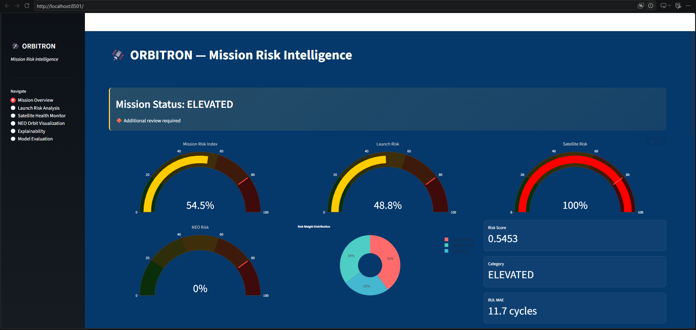
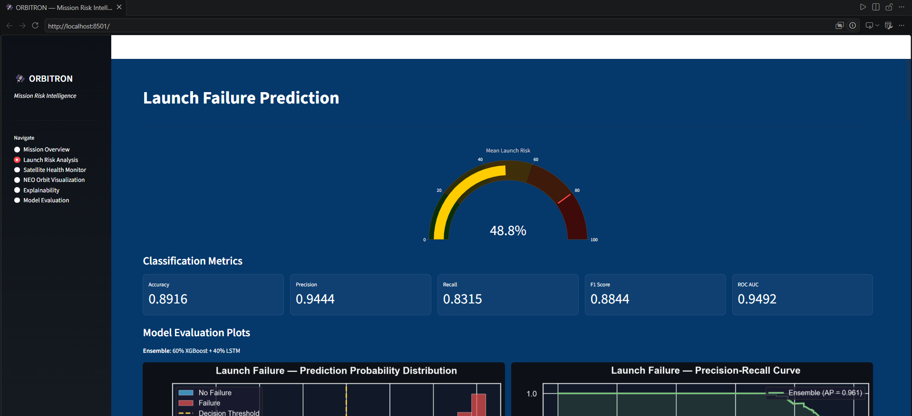
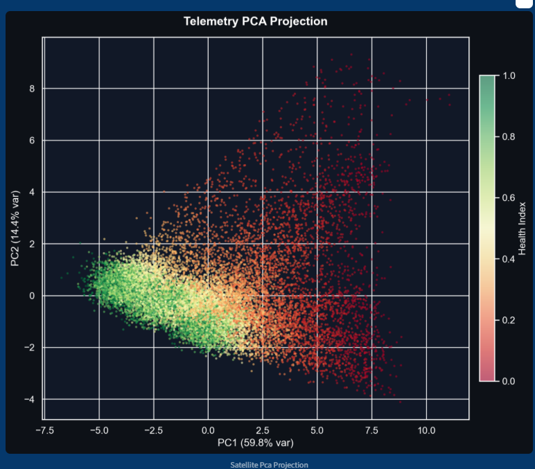
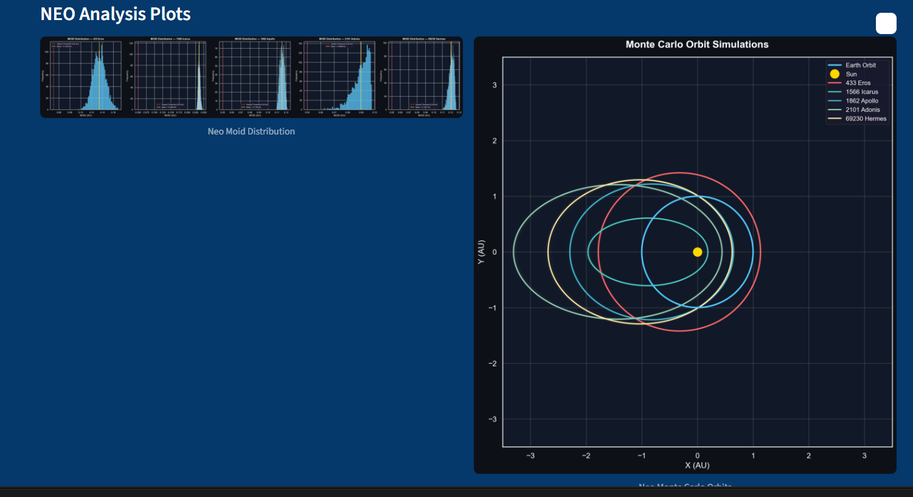
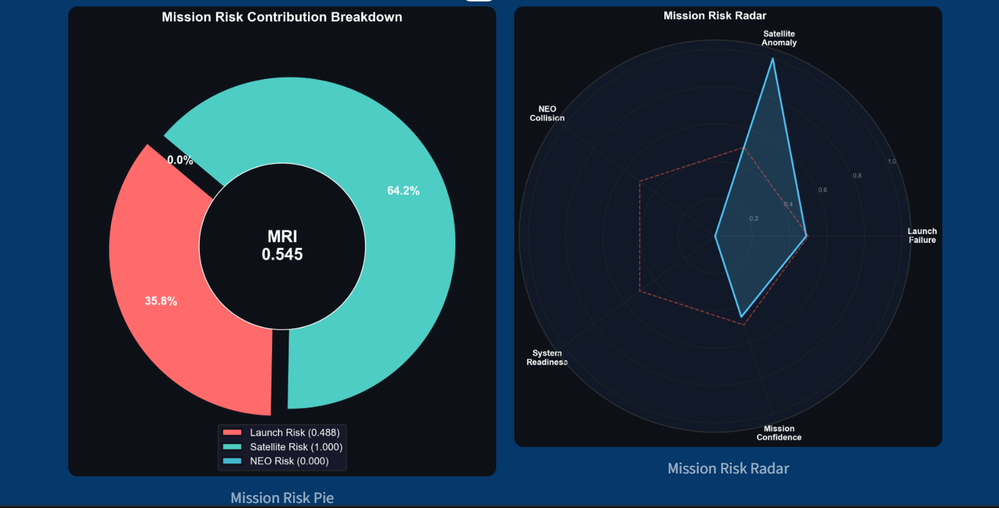
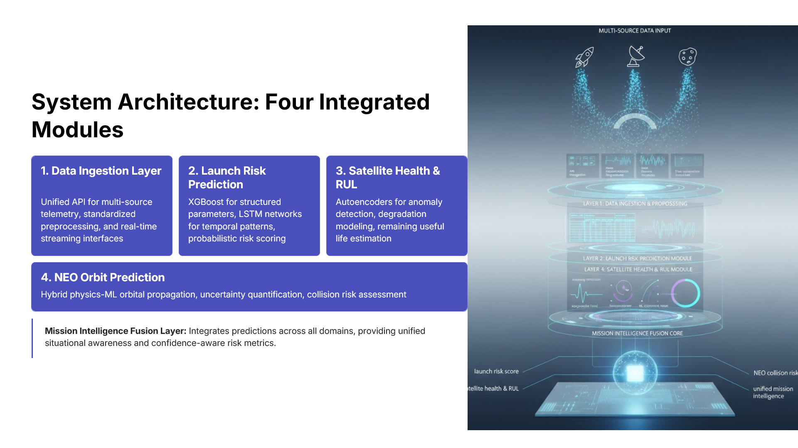
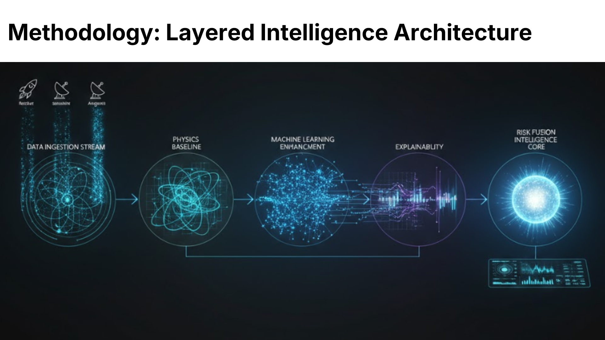

## .............................ORBITRON: AI- Driven Destiny of Rockets & Stars...............................

## AI-Driven Mission Risk Intelligence Framework

> An integrated Physics-ML Hybrid Intelligence framework for Launch Failure Prediction, Remaining Useful Life (RUL) Estimation, Near-Earth Object (NEO) Trajectory Prediction, and Mission Risk Intelligence.


#  Features

-  AI-based Rocket Launch Failure Prediction
-  Satellite Health Monitoring using Deep Learning
-  Remaining Useful Life (RUL) Estimation
-  Near-Earth Object (NEO) Trajectory Prediction
-  Mission Risk Intelligence Dashboard
-  Explainable AI using SHAP
-  Interactive data visualizations with Streamlit
-  Modular and scalable project architecture

##  Project Status

--> Project type : Final Year B.Tech Project

--> Domain: Artificial Intelligence & Data Science

--> Status: Completed

--> Developed using Python, Machine Learning, Deep Learning, Explainable AI and Streamlit,VsCode.


#  Screenshots
# --------   These are the screenshots of my results   --------------------
## Home Page



## Mission Risk Dashboard


## Launch Prediction



## Satellite Health Monitoring



## NEO Prediction



## Mission Evaluation


#  SYSTEM ARCHITECTURE



# METHODOLOGY



# ---------------------   Installation--------------------

## Clone the repository

```bash
git clone https://github.com/YOUR_USERNAME/Orbitron.git
```

## Navigate to the project directory

```bash
cd Orbitron
```

## Install the required packages

```bash
pip install -r requirements.txt
```

## Run the application

```bash
python run.py
```

> **Note:** Trained models and certain datasets are intentionally excluded from this public repository. Therefore, some modules may not execute fully. This repository is intended to demonstrate the project architecture, implementation, and technical contributions.
#  My Contributions

As a member of the ORBITRON project team(4 members), I contributed to:

- Data collection & Data preprocessing
- Machine Learning model training and used
- Streamlit dashboard development
- Project documentation
- Feature implementation


